# Analyze COVID-19- Data using python notebook within Microsoft Azure Machine Learning.
At present, we face a unique challenge with the (COVID-19), (COVID-19) is an infectious disease caused by a newly discovered coronavirus. With no vaccine or cure, populations have been instructed to physically separate from each other in an attempt to stem the tide of infection, prompting massive social distancing measures and lockdowns that have sparked fear and uncertainty.

At the time, hospitals and healthcare facilities implemented strict infection control measures with increased intensity. So Microsoft needs to develop a new way to give their customer needed forecasting and reporting about this epidemic until we pass this situation safely. We can easily recognize how science and AI / Analytics can help to remediate and minimize the risk.

# Use Cases # 1

**Problem Statement:**
The capacity for COVID-19 testing is still low in many countries around the world. 

**Hypothesis:**
Hypothesis is that we can helps in prioritizing the Testing also helps in determining the priority of giving limited healthcare services.

**Impact:**
Testing allows infected people to know that they are infected. This can help them receive the care they need, and it can help them take measures to reduce the probability of infecting others. People who don’t know they are infected might not stay at home and thereby risk infecting others.

**Features:**
1) Country wise Correlation (death, recovered, confirmed) for this as we discussed now (demographic wise Correlation gender, age, city ,nationality, occupation)
2) COVID-19 Trend Comparison for Confirmed Cases between Saudi Arabia and the Top 10 Countries
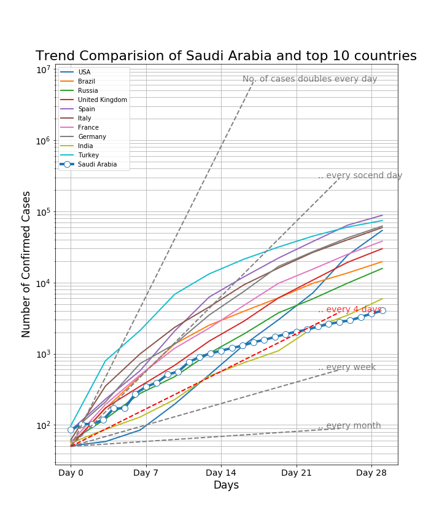
3) COVID-19 Forecasting for Saudi Arabia for confirmed cases 14 days in advance. There are three Algorithms used (PLS, Vector Regressor, and Random Forest), but the Random forest regression algorithm performed well. I got a minimum mean absolute error and root mean squared error.
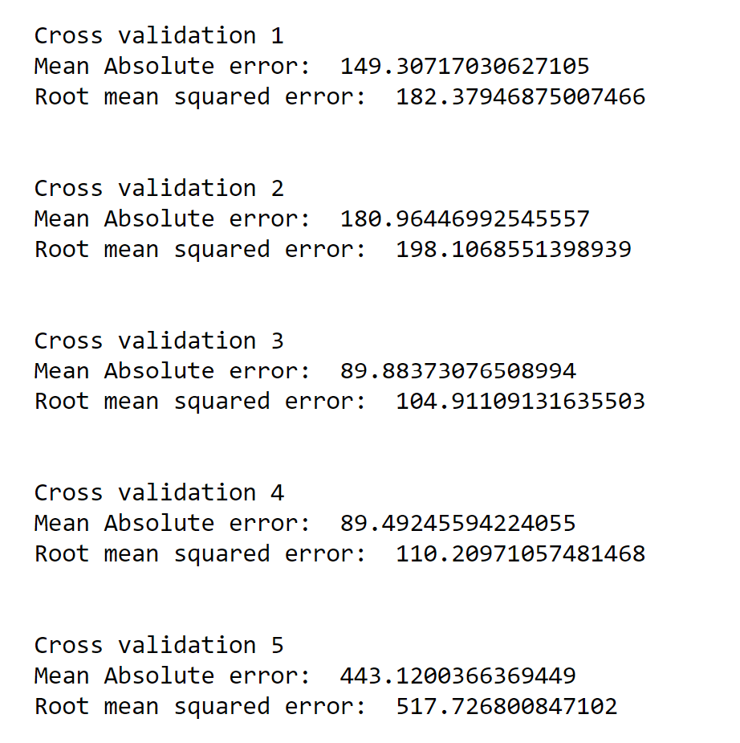
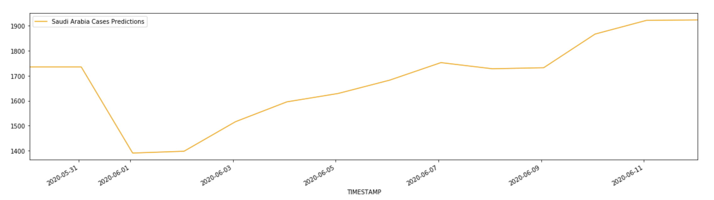
4) COVID-19 Forecasting for Saudi Arabia for death cases 14 days in advance.There are three Algorithms used (PLS, Vector Regressor, and Random Forest), but the Random forest regression algorithm performed well. I got a minimum mean absolute error and root mean squared error.
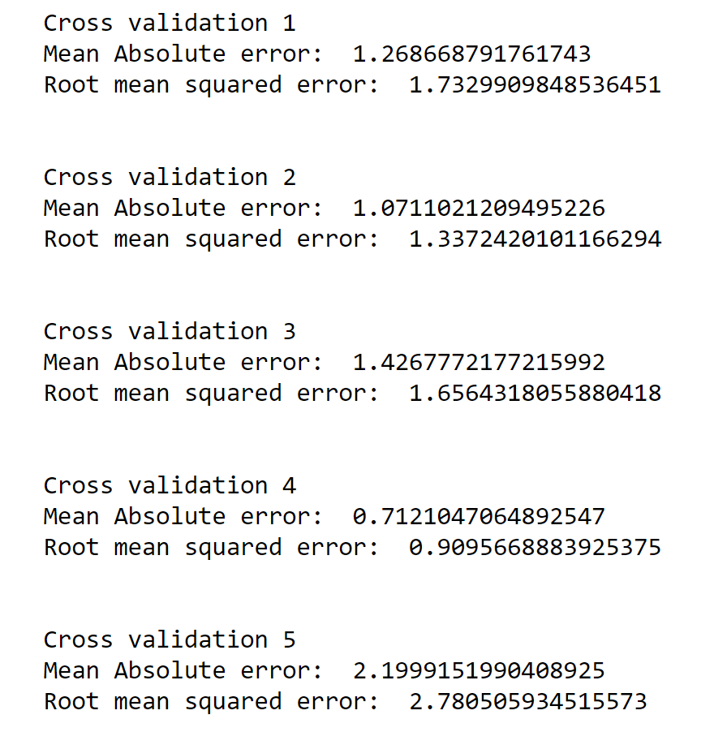
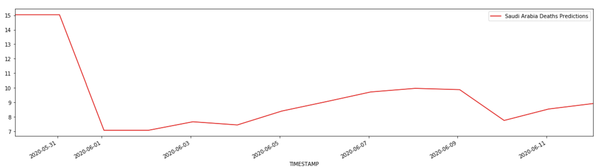

# Additional Analysis 

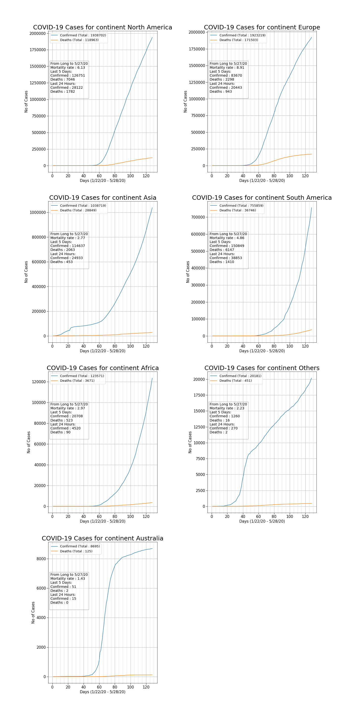

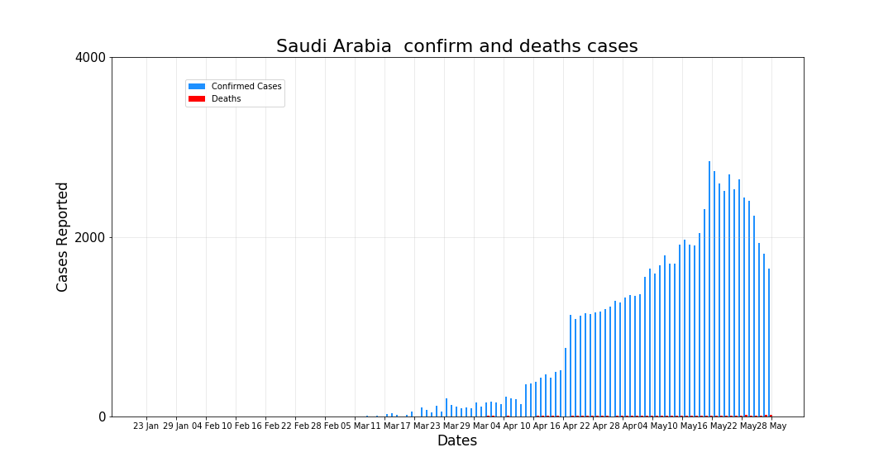

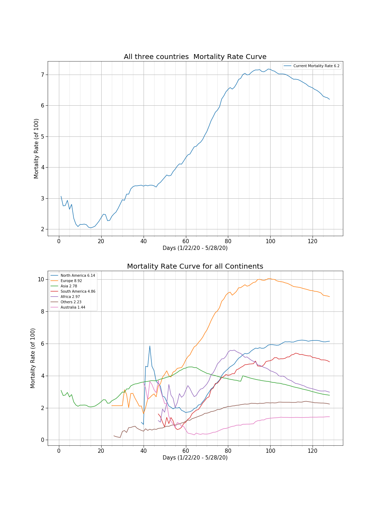

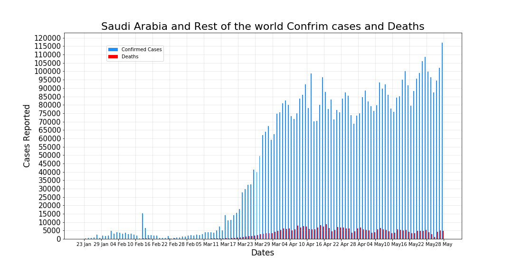

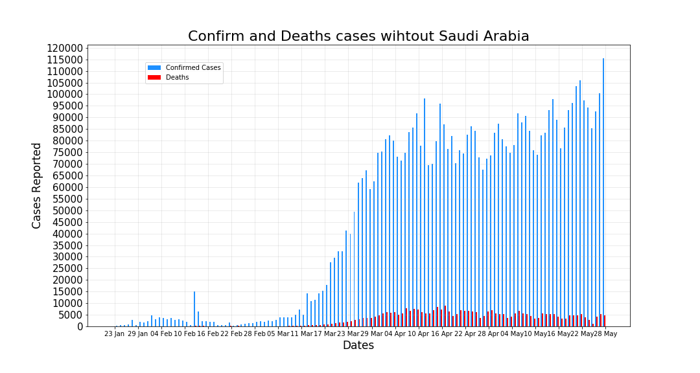

**Approach:**
Prioritize the testing using the Priority-based Automated Testing System
Doing this let’s say we categorize the population into 3 categories as follows:
1) Self-Quarantined - Still working on to find the data

2) Test-Priority (WIP)

3) Healthcare services-Priority (WIP)

# Use Case # 2 

**Problem Statement:**
Health resources are limited across the world. Increasing number of coronavirus patients threatens the ability of health organizations to take care of everyone

**Hypothesis:**
Our hypothesis is that when we apply this method, the increase in the cases will be slow and controllable because the periods where the switch is off and social distancing is stopped are limited and followed by practicing social distancing again.

**Impact:**
This method will help in flattening the curve which will delay the time until the peaks. Therefore, it will buy time for health organizations to increase their resources

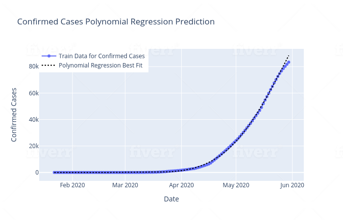

**Approach:**
The goal is to control the increasing infection with the virus. The light switch method applies certain intervention strategies (like social distancing) for a certain period of time and then stops applying them for another limited period of time. 

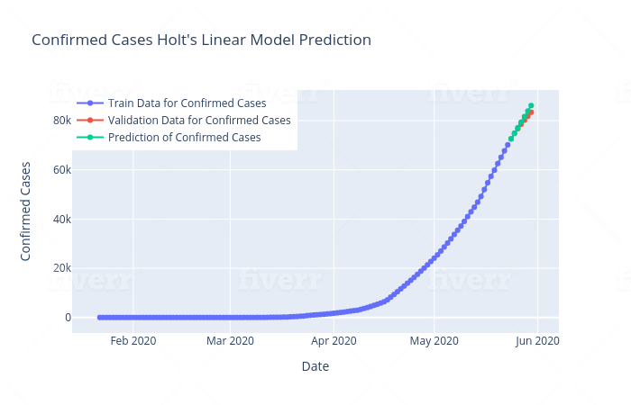

Comparison between Saudi Arabia with other countries most affected by the outbreak. For some countries there are  strong correlation between number of confirmed case and median age. Also between confirmed case with population density. There are no strong correlation between Hospital Bed and cases.
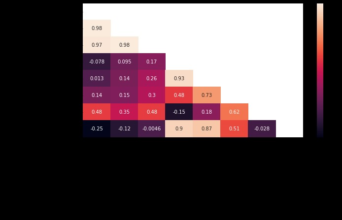

## This correlation matrix shows that Median Age has strong positive correlation with confirmed case, also for the population density.

### Prediction using Polynomial Regression, SVM, Holt's Linear, and Prophet's.

### Polynomial Regression
If Linear Regression requires the relation between the dependent variable and the independent variable to be linear, than Polynomial regression is a form of linear models that can be used to fit non-linear data. It’s provides the best approximation of the relationship between the dependent and independent variable. Polynomial regression fits a nonlinear relationship between the value of x and the corresponding conditional mean of y, denoted E(y |x). To generate polynomial features we have to declare a polynomial degree. We can change the degree to get more accuracy on the prediction.

### SVM
Support Vector Machines (SVMs) in the first time was used in many classification problems. However, this method can be used in regression as well. This kind of regression models
are known as Support Vector Regression Machines or just Support Vector Regression (SVR).

Most important SVR parameter is Kernel type. It can be linear, polynomial or gaussian SVR. We have a non-linear condition so in the notebook we select polynomial kernel with degree of 6 and using gamma scale.

### Holt's Linear
Holt's Linear  is a Time Series Forecasting Model. Extended from simple exponential smoothing (solution to data with no clear trend or seasonality) to allow the forecasting of data with trends. Holt’s method involves a forecast equation and two smoothing equations (one for the level and one for the trend). It use weighted averages of past observations to forecast new values. Here, the idea is to give more importance to recent values in the series. Holt’s model works by explicitly provide the model with the smoothing parameter.

### Facebook Prophet
Prophet is a procedure for forecasting time series data based on an additive model where non-linear trends are fit with yearly, weekly, and daily seasonality. Calculation forecast per day by feeding actual data together with an estimated carrying capacity value.

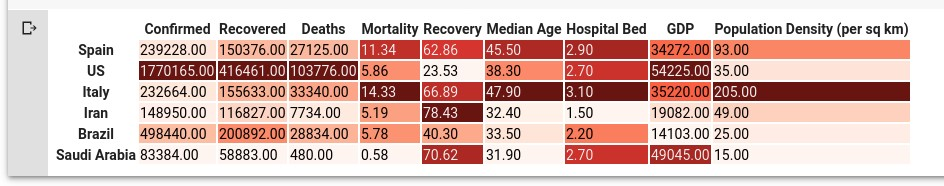

# Data
There are many sources available, but, I will be using data from [Our world in Data which has the testing data](https://ourworldindata.org/coronavirus-testing) and [COVID-19 Data from John Hopkins](https://github.com/CSSEGISandData/COVID-19).

Here is a list of other data sources:
1) Point 3 Acres
2) Johns Hopkins CSSE
3) The COVID Tracking Project
4) Ding Xiang Yuan
5) Worldometer, 
6) WHO Coronavirus Disease (COVID-19)
7) HDX Novel Coronavirus (COVID-19) Cases Data

# Prerequisite
For this experiment, I will be using Azure Machine Learning services from which I will use python notebook. The instruction to provision can be found [here](https://azure.microsoft.com/en-us/resources/videos/provisioning-ml-workspaces-from-portal/).

