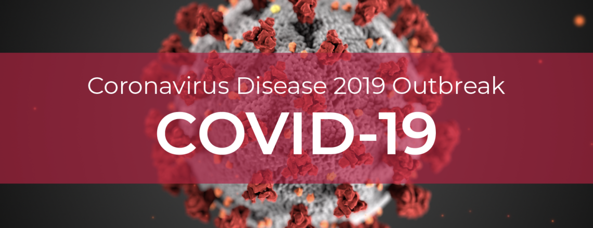

# Analyze COVID-19- Data using python notebook within Microsoft Azure Machine Learning.
At present, we face a unique challenge with the (COVID-19), (COVID-19) is an infectious disease caused by a newly discovered coronavirus. With no vaccine or cure, populations have been instructed to physically separate from each other in an attempt to stem the tide of infection, prompting massive social distancing measures and lockdowns that have sparked fear and uncertainty.

At the time, hospitals and healthcare facilities implemented strict infection control measures with increased intensity. So Microsoft needs to develop a new way to give their customer needed forecasting and reporting about this epidemic until we pass this situation safely. We can easily recognize how science and AI / Analytics can help to remediate and minimize the risk.

# Use Cases # 1

**Problem Statement:**
The capacity for COVID-19 testing is still low in many countries around the world. 

**Hypothesis:**
Hypothesis is that we can helps in prioritizing the Testing also helps in determining the priority of giving limited healthcare services.

**Impact:**
Testing allows infected people to know that they are infected. This can help them receive the care they need, and it can help them take measures to reduce the probability of infecting others. People who don’t know they are infected might not stay at home and thereby risk infecting others.

**Approach:**
Prioritize the testing using the Priority-based Automated Testing System
Doing this let’s say we categorize the population into 3 categories as follows:
Category 1 (Self-Quarantined)
Category 2 (Test-Priority)
Category 3 (Healthcare services-Priority)

# Use Case # 2

**Problem Statement:**
Health resources are limited across the world. Increasing number of coronavirus patients threatens the ability of health organizations to take care of everyone

**Hypothesis:**
Our hypothesis is that when we apply this method, the increase in the cases will be slow and controllable because the periods where the switch is off and social distancing is stopped are limited and followed by practicing social distancing again.

**Impact:**
This method will help in flattening the curve which will delay the time until the peaks. Therefore, it will buy time for health organizations to increase their resources

**Approach:**
The goal is to control the increasing infection with the virus. The light switch method applies certain intervention strategies (like social distancing) for a certain period of time and then stops applying them for another limited period of time. 

# Data
There are many sources available, but, I will be using data from [Our world in Data which has the testing data](https://ourworldindata.org/coronavirus-testing) and [COVID-19 Data from John Hopkins](https://github.com/CSSEGISandData/COVID-19).

Here is a list of other data sources:
1) Point 3 Acres
2) Johns Hopkins CSSE
3) The COVID Tracking Project
4) Ding Xiang Yuan
5) Worldometer, 
6) WHO Coronavirus Disease (COVID-19)
7) HDX Novel Coronavirus (COVID-19) Cases Data

# Prerequisite
For this experiment, I will be using Azure Machine Learning services. The instruction to provision can be found [here](https://azure.microsoft.com/en-us/resources/videos/provisioning-ml-workspaces-from-portal/).

